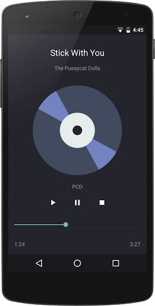
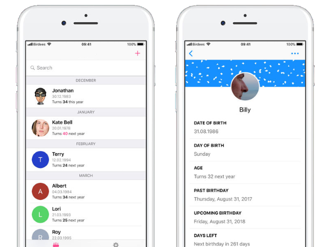
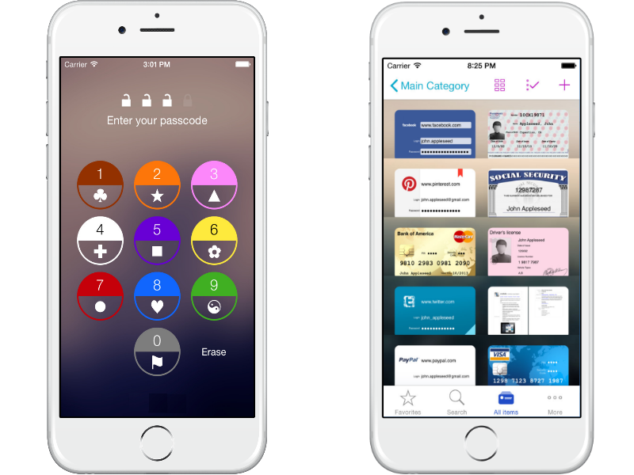

# Graduation проекты

Ниже вы можете найти примеры приложений, которые можно взять за основу, если нет своих идей или Вы не уверены, что Ваша идея подходит для финального проекта. Картинки даны исключительно для примера дизайна, делать похожим необязательно.

## TV Guide (программа телепередач)

Приложение для просмотра программы телепередач.

**Требования к приложению:**
- Информация о каналах и программах должна сохраняться в БД.
- Приложение должно уметь работать при отсутствующем интернет-соединении (в данном случае можно сделать информирование пользователя о том, что работа производится с ранее сохраненными данными).
- Должна быть реализована возможность поиска каналов.
- Пользователь должен иметь возможность сортировать каналы. Для этого необходимо реализовать страницу настроек приложения.

## Player Share (аудиоплеер)

Приложение для совместного прослушивания и управления проигрыванием музыки.

**Требования к приложению:**
- Проигрывание популярных аудиоформатов.
- Возможность работы приложения в background режиме.
- Синхронизация с другим устройством и совместное управление музыкой.

## Birthday Reminder (напоминалка о Днях Рождения друзей)

Агрегатор Дней Рождения друзей и знакомых из социалок и контактной книги.

**Требования к приложению:**
- Сбор сведений о дате рождения друзей из социальных сетей и контактной книги.
- Возможность добавления людей вручную.
- Фильтрация списка друзей по различным полям.
- Оповещения о Днях Рождения.
- Настройки оповещений (предварительные напоминания и т.д.)

## Card Keeper (хранилище информации о кредитных карточках)

Программа для хранения скидочных/дебетовых/кредитных карт, которые с помощью камеры распознаются и сохраняются локально и безопасно. Можно использовать скидочные карты с помощью телефона (отображение штрихкод карточки на экране смартфона).

**Требования к приложению:**
- Сохраненные данные должны быть надежно защищены от чтения извне.
- Доступ к чтению сохраненной информации из приложения должен сопровождаться вводом пароля или иным способом защиты.

---
 IT Shark Community
