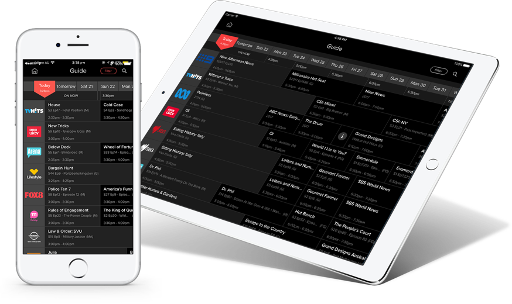

# Graduation проекты

...

Ниже вы можете найти примеры приложений, которые можно взять за основу, если нет своих идей или Вы не уверены, что Ваша идея подходит для финального проекта. Картинки даны исключительно для примера дизайна, делать похожим необязательно.

## TV Guide (программа телепередач)

Приложение для просмотра программы телепередач.

**Требования к приложению:**
- Информация о каналах и программах должна сохраняться в БД.
- Приложение должно уметь работать при отсутствующем интернет-соединении (в данном случае можно сделать информирование пользователя о том, что работа производится с ранее сохраненными данными).
- Должна быть реализована возможность поиска каналов.
- Пользователь должен иметь возможность сортировать каналы. Для этого необходимо реализовать страницу настроек приложения.

---
 IT Shark Community
