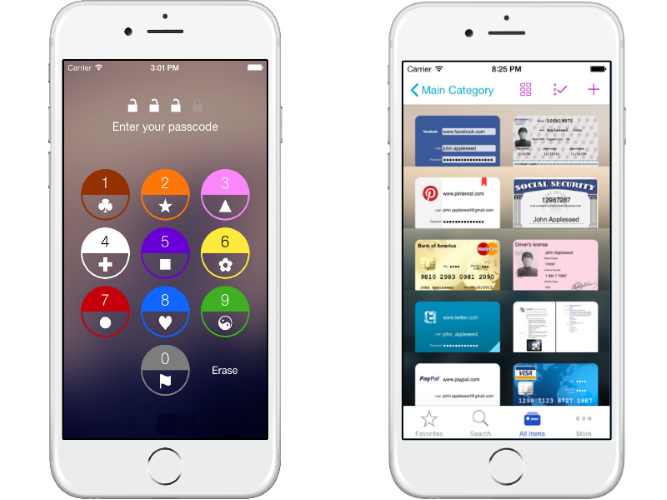
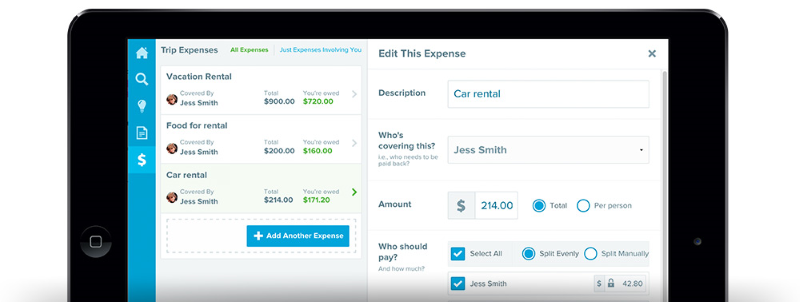
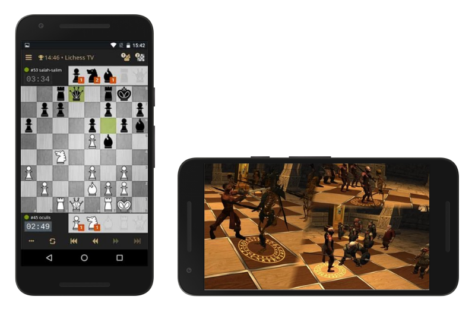

# Graduation проекты

Ниже вы можете найти примеры приложений, которые можно взять за основу, если нет своих идей или Вы не уверены, что Ваша идея подходит для финального проекта. Картинки даны исключительно для примера дизайна, делать похожим необязательно.

## TV Guide (программа телепередач)

Приложение для просмотра программы телепередач.

**Требования к приложению:**
- Информация о каналах и программах должна сохраняться в БД.
- Приложение должно уметь работать при отсутствующем интернет-соединении (в данном случае можно сделать информирование пользователя о том, что работа производится с ранее сохраненными данными).
- Должна быть реализована возможность поиска каналов.
- Пользователь должен иметь возможность сортировать каналы. Для этого необходимо реализовать страницу настроек приложения.

## Player Share (аудиоплеер)

Приложение для совместного прослушивания и управления проигрыванием музыки.

**Требования к приложению:**
- Проигрывание популярных аудиоформатов.
- Возможность работы приложения в background режиме.
- Синхронизация с другим устройством и совместное управление музыкой.

## Birthday Reminder (напоминалка о Днях Рождения друзей)

Агрегатор Дней Рождения друзей и знакомых из социалок и контактной книги.

**Требования к приложению:**
- Сбор сведений о дате рождения друзей из социальных сетей и контактной книги.
- Возможность добавления людей вручную.
- Фильтрация списка друзей по различным полям.
- Оповещения о Днях Рождения.
- Настройки оповещений (предварительные напоминания и т.д.)

## Card Keeper (хранилище информации о кредитных карточках)

Программа для хранения скидочных/дебетовых/кредитных карт, которые с помощью камеры распознаются и сохраняются локально и безопасно. Можно использовать скидочные карты с помощью телефона (отображение штрихкод карточки на экране смартфона).

**Требования к приложению:**
- Сохраненные данные должны быть надежно защищены от чтения извне.
- Доступ к чтению сохраненной информации из приложения должен сопровождаться вводом пароля или иным способом защиты.

## Money Splitter (приложение для подсчета долговых обязательств между людьми)

Программа, которая позволяет вносить, хранить и аккумулировать долги в компании людей, позволяя, в конечном итоге, просто расчитать всю команию людей и узнать кто/кому/сколько должен. Может работать с несколькими валютами, и позволяет переводить долги из одной валюты в другую по обменному курсу.

**Требования к приложению:**
- Добавление различные мероприятий (и людей участвущих в мероприятии), в которых может потребоваться расчет долгов: путешествия, рестораны и т.д.
- Добавление долгов/платежей в различной валюте. Так же, к каждому долгу/платежу добавить выбор людей, которые участвовали в платеже/долге.
- Аккумулирование долгов и предоставление полной информации (конкретный расчет людей) по мероприятию.
- Предоставление истории долгов/платежей по мероприятию.
- Настройки оповещений (напоминания об неоплаченных долгах).

## Chess (Шахматы)

Игра в шахматы для двоих (на одном устройстве).  

**Требования к приложению:**
- Создание игры/сессии между игроками (ввод имен игроков).
- Добавление визуализации фигур под боем.
- Добавление анимации хода различных фигур. 
- Возможность просмотра истории игр (выигранных/ничьих/проигранных партий между различными игроками).
- **(optional)** Использовать инструменты дополненной реальности.

---
 IT Shark Community
