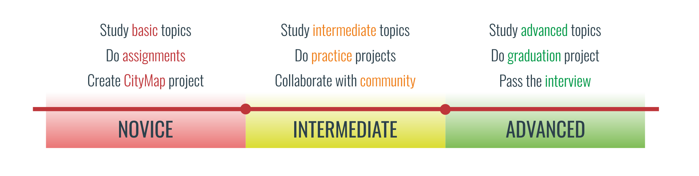
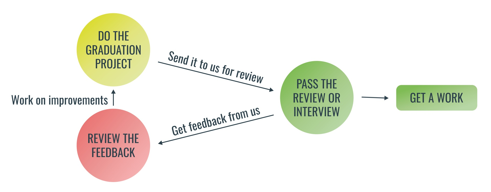

# IT-Shark Mobile School

Добро пожаловать на основной репозиторий **IT-Shark Mobile School**!

Здесь Вы найдете полезную информацию для самообучения по различным мобильным платформам: материалы, ссылки, темы для изучения и т.д. Также Вы можете ознакомиться с процессом обучения, который мы подготовили для Вас.

## Flow

Процесс обучения разделен на 3 уровня обучения: [Novice](#novice-уровень), [Intermediate](#intermediate-уровень), [Advanced](#advanced-уровень). На каждом из уровней есть список активностей, которые Вы можете делать (а можете и не делать :smile:), для того, чтобы поднять Ваш уровень.

## Novice уровень

На начальном уровне обучения Вы получите базовые знания и навыки, которые помогут Вам начать разработку и продвинуться в дальнейшем на `Intermediate` уровень.

**Основные активности:**
- Изучение базовых материалов по языку программирования и платформе в целом
- Выполнение практических заданий по пройденным темам
- Выполнение домашних заданий
- Создание простейших приложений

## Intermediate уровень

Средний уровень обучения предполагает собой продолжение большей части `Novice` активностей, но уже на другом уровне. На данном этапе Вы начнете погружаться в различные особенности платформы и языка программирования, участвовать в жизни сообщества.

**Основные активности:**
- Изучение на более глубоком уровне материалов по языку программирования и платформе
- Прохождение различных сторонних уроков и лекций
- Выполнение домашних заданий
- Создание среднего уровня сложности мобильных приложений
- Участие в жизни сообщества

## Advanced уровень

На углубленном уровне обучения Вы продолжите погружаться в особенности платформы, шлифовать полученные на предыдущих этапах знания и применять их в создании мобильных приложений. После данной ступеньки вы сможете приступить к выполнению `Graduation` проекта.

**Основные активности:**
- Изучение на углубленном уровне материалов по языку программирования и платформе
- Создание мобильных приложений для закрепления полученных знаний
- Участие в жизни сообщества и помощь в его развитии

## Общение

Вы можете пообщаться с нами и другими разработчиками в Slack, чтобы задать интересующие вас вопросы по обучению, задачам и проектам.

Подсключайтесь к itsharkpro на Slack: https://goo.gl/zbm4NG
Присоединяйтесь к каналу #mobile

## Информация о материалах по платформам

**IOS** - для желающих погрузиться в платформу iOS.
- [Материалы для изучения](https://github.com/it-shark-pro/mobile-ios)
- [Рекомендованный путь изучения по уровням](https://github.com/it-shark-pro/mobile-ios/blob/master/learning-path.md)
- [Стартовое приложение CityMap](https://github.com/it-shark-pro/mobile-citymap-ios)

**ANDROID** - для желающих погрузиться в платформу Android.
- [Материалы для изучения](https://github.com/it-shark-pro/mobile-android)
- [Рекомендованный путь изучения по уровням](https://github.com/it-shark-pro/mobile-android/blob/master/learning-path.md)
- [Стартовое приложение CityMap](https://github.com/it-shark-pro/mobile-citymap-android)

**UWP** - для желающих погрузиться в Universal Windows Platform.
- [Материалы для изучения](https://github.com/it-shark-pro/mobile-uwp)
- [Рекомендованный путь изучения по уровням](https://github.com/it-shark-pro/mobile-uwp/blob/master/learning-path.md)
- [Стартовое приложение CityMap](https://github.com/it-shark-pro/mobile-citymap-uwp)

**XAMARIN** - для желающих погрузиться в кроссплатформенную разработку на Xamarin для Android и iOS.
- [Материалы для изучения](https://github.com/it-shark-pro/mobile-xamarin)
- [Рекомендованный путь изучения по уровням](https://github.com/it-shark-pro/mobile-xamarin/blob/master/learning-path.md)
- [Стартовое приложение CityMap](https://github.com/it-shark-pro/mobile-citymap-xamarin)

## Labs & Graduation Project

Graduation Project - Ваш выпускной проект, который Вы готовы показать нам, для получения отзыва. На основании него будет принято решение о приглашении Вас на интервью, по результатам которого будет принято решение о приглашении Вас на дальнейшее обучение или на работу.

Вы можете брать любые свои идеи или предложенные из списка ниже:
- [Labs проекты](LabsProjects.md)
- [Graduation проекты](GraduationProjects.md)

&nbsp;

Есть идеи по развитию или просто хотите исправить ошибку? Вы можете [написать нам](https://github.com/it-shark-pro/mobile-school/issues/new)!

---
 IT Shark Community
